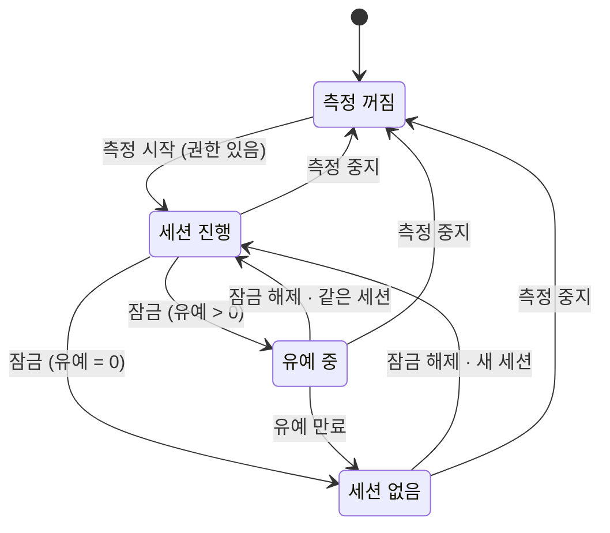

# UsingTime 구현 스펙

연속 사용 시간 알림 Android 앱 "UsingTime"의 구현 착수 스펙. [Wayfinder 지도](https://github.com/sihun0927-sketch/UsingYourTime/issues/1)에서 티켓별로 내린 결정을 한 문서로 조립한 것이며, **결과만** 적는다. 근거와 기각안은 [10. 결정 색인](#10-결정-색인)의 티켓에 있다.

이 문서가 정본이다. 티켓 원문과 다른 곳은 [부록 A](#부록-a-티켓-원문과-달라진-점)에 있다.

## 1. 개요

### 목표

휴대폰을 잠금 해제한 뒤 끊김 없이 계속 사용한 시간을 상태바에 항상 보여주고, 사용자가 정한 임계값에 닿으면 알린다. 앱을 열 필요 없이 알림만으로 쓰는 것이 기본 사용 방식이다.

### 사용자

Google Play 배포 대상 일반 사용자. Android 단독. 무료, 광고 없음, 유료화 계획 없음, 계정·로그인 없음, 네트워크 접근 없음.

### 범위 밖 (v1에서 하지 않음)

- iOS
- 앱별 사용 시간 통계
- 사용 기록 히스토리 화면·그래프 (기록은 기기 안에 저장만 한다)
- 사용 차단·강제 잠금
- Android 16 Live Updates(상태바 칩), `ProgressStyle` 구간별 색
- 커스텀 `RemoteViews` 알림 레이아웃
- `PACKAGE_USAGE_STATS`를 이용한 세션 백필
- 워치독(측정이 멈췄음을 알리는 별도 알림)
- Play 심사 거절 대비 대안 아키텍처 (거절 시 선언문·영상·문구만 고쳐 1회 재제출)

## 2. 용어

도메인 용어는 루트 [`CONTEXT.md`](../../CONTEXT.md)가 정본이다. 이 문서는 그 용어(연속 사용 세션, 유예 시간, 연속 사용 시간, 임계값, 상시 표시, 임계값 알림, 재알림, 재알림 주기, 추정 종료 시각, 측정 시작, 측정 중지, 세션 알림 끄기)를 재정의하지 않고 그대로 쓴다.

## 3. 세션 상태 모델

이 절은 **Android import 없는 순수 Kotlin 클래스**로 구현하고 JUnit으로 전이표를 그대로 검증한다. Android 코드는 이벤트를 넣고 결과를 알림으로 그리기만 한다.

### 상태

| 상태 | 뜻 | 서비스 | 열린 세션 |
|---|---|---|---|
| **측정 꺼짐** | 사용자가 측정 시작을 누른 적이 없거나 측정 중지를 누른 뒤 | 없음 | 없음 |
| **세션 없음** | 측정은 켜져 있고 기기가 잠겨 있으며 열린 세션이 없음 | 실행 중 | 없음 |
| **세션 진행** | 잠금 해제 상태, 세션이 열려 있음 | 실행 중 | 있음 |
| **유예 중** | 잠금(또는 화면 꺼짐) 상태이지만 유예 시간이 아직 지나지 않아 세션이 열려 있음 | 실행 중 | 있음 |

"잠금 해제 상태"의 정의: `PowerManager.isInteractive() == true` 이고 `KeyguardManager.isKeyguardLocked() == false`. 잠금 화면이 '없음'인 기기는 화면이 켜질 때마다 잠금 해제 상태가 되므로 화면 켜짐~꺼짐이 한 세션이 된다. 이 기기를 위한 코드 분기는 없다.

### 이벤트

| 이벤트 | 출처 |
|---|---|
| `측정 시작` | 설정 화면 상태 카드 버튼 |
| `측정 중지` | 설정 화면 상태 카드 버튼 |
| `잠금 해제` | `ACTION_USER_PRESENT` 수신 |
| `잠금` | `ACTION_SCREEN_OFF` 수신 |
| `화면 켜짐` | `ACTION_SCREEN_ON` 수신 (잠금 해제 없이 잠금 화면만 켜진 것) |
| `유예 만료` | 유예 타이머 또는 `setAndAllowWhileIdle` 알람, 또는 `화면 켜짐`·`잠금 해제` 시 타임스탬프 재판정 |
| `임계값 도달` | 세션 진행 중 `elapsedRealtime` 타이머 |
| `재알림 주기 경과` | 세션 진행 중 `elapsedRealtime` 타이머 |
| `세션 알림 끄기` | 임계값 알림의 액션 버튼 |
| `1분 tick` | 서비스 내 타이머 |
| `서비스 재시작` | START_STICKY 재시작, `BOOT_COMPLETED`, `MY_PACKAGE_REPLACED`, 앱 실행 시 재기동 |

### 전이표

| 현재 상태 | 이벤트 | 다음 상태 | 하는 일 |
|---|---|---|---|
| 측정 꺼짐 | `측정 시작` | 세션 진행 | 알림 권한 확인(없으면 전이 없음). 서비스 시작. **지금** 세션 시작(버튼을 누른 시점은 잠금 해제 상태). 상시 표시 게시 |
| 세션 없음 | `잠금 해제` | 세션 진행 | 지금 새 세션 시작. 알림 상태(임계값 알림 여부·재알림·세션 알림 끄기) 초기화. 재시작 안내 1회성 플래그가 있으면 해제. 상시 표시를 세션 문구로 갱신 |
| 세션 없음 | `화면 켜짐` / `잠금` | 세션 없음 | 없음. 잠금 화면 '없음' 감지 재판정(5절) |
| 세션 진행 | `잠금` | 유예 중 (유예 시간이 0이면 곧바로 **세션 없음**) | 잠금 시각 저장. 유예 만료 알람 예약. 상시 표시를 유예 문구로 갱신. 유예 0이면 `유예 만료`와 같은 처리 |
| 세션 진행 | `잠금 해제` | 세션 진행 | 없음 (잠금 화면 '없음' 기기는 화면이 켜질 때마다 이 이벤트가 오므로 무시) |
| 세션 진행 | `임계값 도달` | 세션 진행 | 임계값 알림 발송(4절 조건). 재알림 타이머 시작 |
| 세션 진행 | `재알림 주기 경과` | 세션 진행 | 재알림 발송(4절 조건). 재알림 타이머 재시작 |
| 세션 진행 | `1분 tick` | 세션 진행 | heartbeat 저장(7절). 상시 표시 본문·막대 갱신 |
| 유예 중 | `잠금 해제` (gap ≤ 유예) | 세션 진행 | 같은 세션 계속. **즉시 판정**: 연속 사용 시간 ≥ 임계값인데 아직 알린 적 없으면 임계값 알림 1회; 이미 알렸고 마지막 알림 이후 재알림 주기 이상 지났으면 재알림 **1회**(밀린 횟수 몰아 보내기 없음). 재알림 타이머는 그 알림부터 다시 센다. 상시 표시 세션 문구로 |
| 유예 중 | `화면 켜짐` | 유예 중 | 저장된 잠금 시각으로 유예 만료 여부 재판정. 만료면 `유예 만료` 처리. 임계값 알림은 보내지 않는다 |
| 유예 중 | `유예 만료` | 세션 없음 | 세션을 **잠금 시각**으로 닫는다(종료 원인 `GRACE_EXPIRED`). 임계값 알림 제거. 세션 알림 끄기 해제. 상시 표시를 대기 문구로 갱신 |
| 유예 중 | `1분 tick` | 유예 중 | 상시 표시의 남은 유예 갱신 (Doze로 늦어도 허용, 정본은 `화면 켜짐`·`잠금 해제` 재판정) |
| 유예 중 | `잠금` | 유예 중 | 없음 |
| 세션 진행 · 유예 중 | `세션 알림 끄기` | 그대로 | 세션의 `muted = true`. 임계값 알림 제거. 상시 표시 본문에 "이번 세션 알림 꺼짐". 되돌리기 없음, 세션이 닫힐 때 자동 해제 |
| 세션 없음 · 세션 진행 · 유예 중 | `측정 중지` | 측정 꺼짐 | 열린 세션이 있으면 **지금** 닫는다(유예 없음, 종료 원인 `PAUSED`). 상시 표시·임계값 알림 제거. 서비스 종료. `tracking_on = false` |
| 측정 꺼짐 | `서비스 재시작` | 측정 꺼짐 | 아무것도 띄우지 않는다 (`tracking_on == false`) |
| (서비스 없음, `tracking_on == true`) | `서비스 재시작` | 7절 재동기화 규칙이 정하는 상태 | `startForeground` 뒤 7절 규칙 적용 |

임계값·재알림 판정은 항상 `연속 사용 시간 = 지금 − 세션 시작 시각`(유예 구간 포함)으로 한다. 잠금 중에는 임계값 알림·재알림을 **절대** 보내지 않는다.

### 상태 다이어그램

### 설정 변경 중 동작

임계값·유예 시간·재알림 주기·임계값 알림 토글은 저장 즉시 적용되며 다음 판정부터 새 값을 쓴다. 세션 진행 중 임계값을 이미 지난 값으로 낮추면 다음 `1분 tick`에서 `임계값 도달`로 처리한다. 진행 중인 세션을 끊거나 초기화하지 않는다.

## 4. 알림 규칙

레이아웃은 **표준 `Notification.Builder` 템플릿만** 쓴다. 커스텀 `RemoteViews`·`DecoratedCustomViewStyle` 없음. 잠금 화면 `VISIBILITY_PUBLIC`. 작은 아이콘 1개 고정, 상태에 따라 바꾸지 않는다.

### 채널

| 채널 id | 용도 | 중요도 | 소리·진동 |
|---|---|---|---|
| `tracking` | 상시 표시 | `IMPORTANCE_LOW` | 없음 |
| `threshold` | 임계값 알림·재알림 | `IMPORTANCE_HIGH` (heads-up) | 채널 기본값(사용자가 OS 설정에서 조절) |

알림 id는 상시 표시 1개, 임계값 알림 1개로 고정한다. 재알림은 임계값 알림과 같은 id로 다시 게시해 알림 창에 한 개만 남는다.

### 상시 표시 (채널 `tracking`, ongoing, 액션 없음)

포그라운드 서비스의 알림이다. 측정이 켜진 동안 항상 있다. Android 14+에서 사용자가 스와이프로 지우면 다음 갱신(`1분 tick`)에 다시 게시한다. 탭하면 설정 화면.

| 상태 | 헤더 시간 | 제목 | 막대 (`setProgress`) | 본문 |
|---|---|---|---|---|
| 세션 없음 | 없음 | "측정 대기 중" | 없음 | "잠금 해제하면 세션이 시작돼요" |
| 세션 진행 · 임계값 전 | chronometer (세션 시작 시각 기준, 초 단위 자동 갱신) | "연속 사용 중" | `max = 임계값(분)`, `progress = 경과(분)`, 색 = 앱 accent | "임계값 30분까지 N분 남음" |
| 세션 진행 · 초과 | chronometer | "연속 사용 중 · 임계값 30분 초과" | 가득 참, 색 = **경고색** | "다음 알림 N분 후" (임계값 알림 토글이 꺼져 있으면 "임계값 30분 초과") |
| 세션 진행 · 초과 · 세션 알림 끄기 이후 | chronometer | 위와 같음 | 가득 참, 경고색 | "임계값 초과 · 이번 세션 알림 꺼짐" |
| 유예 중 | chronometer (계속 증가) | 초과 여부에 따라 위 규칙 | 초과 여부에 따라 위 규칙 | "잠금 중 · 유예 m:ss 남음" |

- 갱신: chronometer는 시스템이 알아서, 제목·본문·막대는 `1분 tick`마다 `notify()` 1회. 유예 중 본문의 초 단위가 필요하면 유예 중에만 갱신 주기를 올려도 된다.
- **경고색 규칙**: `setColor()`를 앰버 계열(프로토타입 기준 `#F5B547`, 정확한 값은 구현 시 대비 보정)로 바꾼다. 막대·작은 아이콘·앱 이름이 함께 물든다. 제목에 "임계값 N분 초과"가 붙는 순간과 항상 같이 움직이며, 유예 중·세션 알림 끄기 이후에도 초과면 유지된다. `setColorized`는 쓰지 않는다. 초과 전은 앱 accent.
- 임계값 알림 토글이 꺼져 있어도 상시 표시의 초과 표기와 경고색은 그대로다.

### 임계값 알림·재알림 (채널 `threshold`, heads-up)

발송 조건 (모두 참일 때): 세션 진행 상태 · 연속 사용 시간 ≥ 임계값 · 설정의 임계값 알림 토글 켜짐 · 세션의 `muted == false`.

| 항목 | 값 |
|---|---|
| 제목 | "45분째 연속 사용 중" (경과 분) |
| 본문 · 첫 알림 | "잠깐 눈을 쉬어 주세요. 계속 쓰면 15분 뒤 다시 알려요." (재알림 주기 반영) |
| 본문 · 재알림 | "15분 뒤 다시 알려요" |
| 부제 (`setSubText`) | 재알림부터 회차: "2번째", "3번째", … |
| 색 | 항상 경고색 |
| 탭 | 설정 화면 |
| 액션 | 1개, 텍스트 스타일, **"이번 세션 알림 끄기"** → `세션 알림 끄기` 이벤트 |
| 스누즈 | 없음. 지우면 다음 재알림까지가 곧 스누즈 |

- 재알림은 직전 알림 시각 기준으로 재알림 주기마다 무한 반복한다. 사용자가 지웠는지와 무관하다.
- 잠금 중에는 보내지 않는다. 유예 중 임계값이나 재알림 주기에 닿으면 다음 `잠금 해제` 직후 1회만 보낸다(3절 전이표).
- 제거 시점: `유예 만료`, `세션 알림 끄기`, `측정 중지`.

## 5. 화면

앱 화면은 **설정 화면 하나**다. 앱 아이콘, 상시 표시 탭, 임계값 알림 탭 모두 이 화면을 열며 딥링크 구분이 없다. 별도 온보딩 화면은 없고 상단 상태 카드가 온보딩을 겸한다. Jetpack Compose + Material 3, edge-to-edge 인셋 처리.

### 구성 (위에서 아래로)

1. **상태 카드** (3줄 목록 + 버튼)
   - 측정 상태: "꺼짐" / "켜짐"
   - 연속 사용 시간: 켜짐이고 세션이 있으면 라이브, 세션 없으면 "세션 없음", 꺼짐이면 "—"
   - 버튼 1개: 꺼짐 → 채운 버튼 **"측정 시작"**, 켜짐 → 테두리(outlined) 버튼 **"측정 중지"**
   - 꺼짐 상태에서는 설명 문단을 항상 표시(첫 실행 전용 분기 없음): "잠금 해제한 뒤 계속 사용한 시간을 상태바에 보여주고, 정한 시간이 지나면 알려드려요."
   - 조건부 안내 줄 (해당할 때만, 위에서부터 우선):
     - 알림 권한 없음: "알림 권한이 꺼져 있어 측정을 시작할 수 없어요 · 설정에서 켜기" (앱 정보 딥링크), 버튼 비활성
     - 세션 알림 끄기 중: "이번 세션 알림 꺼짐"
     - 재시작 안내(1회성): "HH:MM에 측정이 중단됐다가 지금 다시 시작했어요" (7절)
     - 잠금 화면 없음: "잠금 화면이 없어 화면이 켜진 시간을 기준으로 측정합니다"
2. **설정**
   - 임계값: 프리셋 칩 15 / 30 / 45 / 60 / 90 / 120분 + "직접 입력"
   - 유예 시간: 프리셋 칩 0 / 1 / 3 / 5 / 10 / 15분
   - 재알림 주기: 프리셋 칩 5 / 10 / 15 / 30분
   - 임계값 알림: 토글
3. **도움말 "측정이 자주 멈추면"**: 배터리 최적화에서 이 앱을 "제한 없음"으로 두라는 설명 + `ACTION_APPLICATION_DETAILS_SETTINGS` 딥링크 버튼 1개. 제조사별 문구 없음.
4. **개인정보처리방침** 행 1개: 브라우저 Intent로 방침 URL 열기.

### 알림 권한 흐름 (API 33+)

"측정 시작" 탭 시점에 `POST_NOTIFICATIONS`를 요청한다. 요청 전 상태 카드에 1줄: "연속 사용 시간을 상태바에 보여주려면 알림 권한이 필요해요". 거부되면 위 조건부 안내 줄을 띄우고 버튼을 비활성화한다. 권한 없이 서비스만 돌리지 않는다. API 32 이하는 요청 없이 진행한다.

### 잠금 화면 '없음' 감지

`ACTION_SCREEN_ON` 직후 `KeyguardManager.isKeyguardLocked() == false`면 잠금 화면 없음으로 보고 안내 줄을 켠다. 매 `SCREEN_ON`마다 재판정하므로 잠금 설정을 바꾸면 자연히 사라진다. 권한 불필요.

## 6. 설정 값

| 설정 | 기본값 | 범위·단위 | 입력 |
|---|---|---|---|
| 임계값 | 30분 | 10분 ~ 4시간, 5분 단위 | 프리셋 칩 + 직접 입력(범위·단위 안에서만) |
| 유예 시간 | 3분 | 0 ~ 15분 | 프리셋만. 0 = 잠그면 즉시 세션 종료 |
| 재알림 주기 | 15분 | 5 / 10 / 15 / 30분 | 프리셋만 |
| 임계값 알림 | 켜짐 | on/off | 토글. 끄면 상시 표시만 유지 |

## 7. 복구 정책

### heartbeat와 추정 종료 시각

- 세션 진행 상태에서만 `1분 tick`마다 열린 세션 행의 `last_alive_at`을 덮어쓴다. 유예 중에는 잠금 시각을 이미 기록했으므로 쓰지 않는다.
- **추정 종료 시각** = `max(last_alive_at, locked_at)`. 최대 오차 1분.
- `PACKAGE_USAGE_STATS` 백필은 하지 않는다.

### 재시작 재동기화 (모든 경로 단일 규칙)

START_STICKY 재시작(에뮬레이터에서 2초 안에 되살아나며 `onStartCommand(intent == null)`에서 `startForeground()` 성공 확인), `BOOT_COMPLETED`, `MY_PACKAGE_REPLACED`, 앱 실행 시 재기동 모두 같다. `tracking_on == true`일 때만 서비스를 띄우고, 열린 세션이 있으면:

1. `gap = 지금 − 추정 종료 시각`. 현재 상태는 `isKeyguardLocked()`·`isInteractive()`로 읽는다.
2. 잠금 해제 + `gap ≤ 유예 시간` → **세션 진행**으로 같은 세션 계속. 시작 시각 그대로, gap은 연속 사용 시간에 포함.
3. 잠금 상태 + `gap ≤ 유예 시간` → 추정 종료 시각에 잠긴 것으로 보고 **유예 중**으로 복원. 유예 타이머는 추정치 기준.
4. `gap > 유예 시간` → 세션을 추정 종료 시각으로 닫고(종료 원인 `ESTIMATED`), 지금 잠금 해제 상태면 **지금** 새 세션 시작(세션 진행), 잠금 상태면 세션 없음. 재시작 안내 1회성 플래그를 켠다.

열린 세션이 없으면 현재 상태만 읽어 잠금 해제면 새 세션 시작, 아니면 세션 없음.

- 재부팅은 예외가 아니다. 사용 중 재부팅 → 1분 뒤 PIN 해제 → gap < 유예 → 세션이 재부팅을 넘어 이어진다.
- 알림 상태(임계값 알림 여부·마지막 알림 시각·회차·세션 알림 끄기)는 세션 행에 속해 함께 복원된다. 세션이 이어지면 임계값 알림이 다시 울리지 않는다.
- Direct Boot(`LOCKED_BOOT_COMPLETED`)는 다루지 않는다.

### 강제 종료·Task Manager "Stop"·OEM 절전 뒤

`tracking_on == true`인데 서비스가 없으면 액티비티 시작 시 서비스를 띄우고 위 규칙을 적용한다. 확인 다이얼로그 없음. Android 15+는 Stopped 상태를 벗어날 때 오는 `BOOT_COMPLETED`가 같은 경로를 탄다. 워치독 없음.

### 사용자 안내

- 재시작 안내(규칙 4로 닫혔고 원인이 측정 중지가 아닐 때): 상태 카드에 "HH:MM에 측정이 중단됐다가 지금 다시 시작했어요". 그 다음 세션이 시작될 때 사라진다.
- 설정 화면 도움말 "측정이 자주 멈추면" (5절).

## 8. 플랫폼·기술

### 권한 (4개, 추가 없음)

`FOREGROUND_SERVICE`, `FOREGROUND_SERVICE_SPECIAL_USE`, `POST_NOTIFICATIONS`(33+), `RECEIVE_BOOT_COMPLETED`.

선언하지 않는 것: `INTERNET`, `PACKAGE_USAGE_STATS`, `SCHEDULE_EXACT_ALARM`·`USE_EXACT_ALARM`, `REQUEST_IGNORE_BATTERY_OPTIMIZATIONS`, AccessibilityService, `AD_ID`.

### 서비스·리시버

- 포그라운드 서비스 1개: `foregroundServiceType="specialUse"`, `PROPERTY_SPECIAL_USE_FGS_SUBTYPE` property, `START_STICKY`. 측정이 켜진 동안 잠금 중에도 유지한다. 알림은 4절의 상시 표시.
- 서비스 안에서 `Context.registerReceiver()`로 `ACTION_USER_PRESENT`, `ACTION_SCREEN_OFF`, `ACTION_SCREEN_ON` 수신 (`RECEIVER_NOT_EXPORTED`). manifest 수신 불가.
- manifest 리시버 1개: `ACTION_BOOT_COMPLETED` + `ACTION_MY_PACKAGE_REPLACED` → `tracking_on`이면 서비스 시작.
- 타이머: 서비스 내 coroutine + `SystemClock.elapsedRealtime()`. 유예 만료 알람만 `AlarmManager.setAndAllowWhileIdle`(보조 수단, Doze 지연 허용). WorkManager·exact alarm 없음.
- 서비스 첫 시작은 사용자의 "측정 시작" 탭뿐. 설치·업데이트만으로 자동 시작하지 않는다.

### 기술 스택

| 항목 | 선택 |
|---|---|
| 언어·빌드 | Kotlin/JVM, Gradle Kotlin DSL, 버전 카탈로그, 단일 `app` 모듈 |
| UI | Jetpack Compose + Material 3 |
| 설정 저장 | Jetpack DataStore (Preferences) |
| 세션 기록 | Room (화면 없음, 기기 내 저장만). 컴파일러는 KSP |
| DI | 없음 (수동 조립) |
| 동시성 | Kotlin coroutines |
| 테스트 | 세션 상태 클래스 JUnit + `kotlinx-coroutines-test`. 서비스·리시버·알림은 실기기 수동 검증. 계측 테스트 없음 |
| CI | GitHub Actions, push/PR마다 `./gradlew test assembleDebug` |

### 저장 항목

시각은 모두 epoch 밀리초(`System.currentTimeMillis()`)로 저장한다. `elapsedRealtime`은 재부팅에서 초기화되므로 프로세스 안의 타이머에만 쓴다.

DataStore 키:

| 키 | 타입 | 기본값 |
|---|---|---|
| `tracking_on` | Boolean | false |
| `threshold_min` | Int | 30 |
| `grace_min` | Int | 3 |
| `realert_min` | Int | 15 |
| `threshold_alert_enabled` | Boolean | true |
| `restart_notice_at` | Long? | null (재시작 안내 1회성, 7절) |

Room 테이블 `sessions`:

| 열 | 타입 | 뜻 |
|---|---|---|
| `id` | Long PK | |
| `started_at` | Long | 세션 시작 |
| `last_alive_at` | Long | heartbeat |
| `locked_at` | Long? | 마지막 잠금 시각 (유예 중일 때) |
| `ended_at` | Long? | 종료 시각. null이면 열린 세션 |
| `end_reason` | enum? | `GRACE_EXPIRED` / `PAUSED` / `ESTIMATED` |
| `threshold_alerted_at` | Long? | 첫 임계값 알림 시각 |
| `last_alert_at` | Long? | 마지막 임계값 알림·재알림 시각 (재알림 주기 기준점) |
| `alert_count` | Int | 회차 (부제 표기용) |
| `muted` | Boolean | 세션 알림 끄기 |

열린 세션은 항상 최대 1행이다.

### API 레벨 분기 (minSdk 28, target 36)

| API | 분기 |
|---|---|
| 33+ | `POST_NOTIFICATIONS` 런타임 요청. 32 이하는 요청 없이 진행 |
| 34+ | `specialUse` 타입·subtype property 필수(33 이하는 타입 무시). `RECEIVER_NOT_EXPORTED` 지정. ongoing 알림 스와이프 해제 가능 → 다음 갱신 때 재게시 |
| 35+ | `BOOT_COMPLETED`에서 `specialUse` FGS 시작 허용. edge-to-edge 기본 |
| 36 | edge-to-edge 강제 → 설정 화면 인셋 처리. 네이티브 라이브러리 없어 16KB 페이지 요건 해당 없음 |
| 28~30 | 백그라운드 FGS 시작 제한 없음. 31+ 제한은 시작 트리거(사용자 탭·BOOT·`MY_PACKAGE_REPLACED`)가 모두 예외 안이라 코드 분기 불필요 |

## 9. 스토어·릴리스

### 빌드 식별

| 항목 | 값 |
|---|---|
| applicationId / namespace | `io.github.sihun0927.usingyourtime` |
| minSdk / targetSdk / compileSdk | 28 / 36 / 36 |
| 앱 이름·라벨 | "UsingTime" (스토어·홈 화면 동일) |
| 스토어 기본 언어 · 카테고리 | ko-KR · 생산성 |
| `android:allowBackup` | false |

### Play Console 선언

- **FGS 선언 (App content › Foreground service)**: 타입 `specialUse`. subtype property 값과 선언문 모두 영문: `User-initiated unlock-to-lock continuous usage timer. Runs only while the user keeps tracking on; shows live elapsed time in a persistent notification; on-device only; user can stop anytime from the app.` 시스템이 중단 시 영향: 세션 감지·임계값 알림이 멈춤.
- **데모 영상**: 사용자가 실기기에서 직접 촬영. 흐름: 측정 시작 탭 → 알림 권한 허용 → 상시 표시 → 임계값 알림·세션 알림 끄기 → 설정에서 측정 중지. 비공개 YouTube 링크로 제출.
- **Data safety**: 수집·공유 없음. 방침 URL 필수.
- 기타: 광고 없음, IARC 설문(전체 이용가 예상), 대상 연령 아동 아님, 정부·금융·건강·뉴스 아님, 앱 액세스 "제한 없음".

### 개인정보처리방침

- 이 저장소 GitHub Pages `docs/privacy-policy.md` → `https://sihun0927-sketch.github.io/UsingYourTime/privacy-policy`
- 한·영 병기. 내용: 수집·전송 없음, 기기 내 저장 항목(설정·세션 시각), 권한 4개의 용도, 연락처.

### 릴리스 체크리스트 (결과물 완성 후, 순서 고정)

1. 빌드 완성, 실기기 검증(복구 경로 포함)
2. 개인 개발자 계정 등록 (US$25, 본인 확인 며칠)
3. 테스터 최소 12명 확보 (본인 제외, 이탈 대비 14~15명)
4. 비공개 테스트 트랙에 올려 12명 참여 상태로 연속 14일 유지
5. Play Console 선언(FGS·Data safety·방침 URL·영상) 제출
6. 프로덕션 접근 신청 → 검토 → 출시. 심사 거절 시 선언문·영상·문구만 고쳐 1회 재제출. 재거절이면 이 스펙 밖(새 지도)

## 10. 결정 색인

| 절 | 근거 티켓 |
|---|---|
| 1 개요 | [#5 수익화](https://github.com/sihun0927-sketch/UsingYourTime/issues/5), 지도 [#1](https://github.com/sihun0927-sketch/UsingYourTime/issues/1) Out of scope |
| 3 세션 상태 모델 | [#9 유예 중 임계값 도달](https://github.com/sihun0927-sketch/UsingYourTime/issues/9), [#10 잠금 화면 '없음'](https://github.com/sihun0927-sketch/UsingYourTime/issues/10), [#14 측정 중지 범위](https://github.com/sihun0927-sketch/UsingYourTime/issues/14), [#4 재알림](https://github.com/sihun0927-sketch/UsingYourTime/issues/4) |
| 4 알림 규칙 | [#4](https://github.com/sihun0927-sketch/UsingYourTime/issues/4), [#7 UI 프로토타입](https://github.com/sihun0927-sketch/UsingYourTime/issues/7), [#16 표준 템플릿·경고색](https://github.com/sihun0927-sketch/UsingYourTime/issues/16), [#9](https://github.com/sihun0927-sketch/UsingYourTime/issues/9), [#15 스펙 조립](https://github.com/sihun0927-sketch/UsingYourTime/issues/15) (세션 없음 문구) |
| 5 화면 | [#14](https://github.com/sihun0927-sketch/UsingYourTime/issues/14), [#7](https://github.com/sihun0927-sketch/UsingYourTime/issues/7), [#10](https://github.com/sihun0927-sketch/UsingYourTime/issues/10), [#12 복구](https://github.com/sihun0927-sketch/UsingYourTime/issues/12), [#13 스토어](https://github.com/sihun0927-sketch/UsingYourTime/issues/13) |
| 6 설정 값 | [#3 기본값·범위](https://github.com/sihun0927-sketch/UsingYourTime/issues/3), [#4](https://github.com/sihun0927-sketch/UsingYourTime/issues/4) |
| 7 복구 정책 | [#12](https://github.com/sihun0927-sketch/UsingYourTime/issues/12), [#8 START_STICKY 기기 테스트](https://github.com/sihun0927-sketch/UsingYourTime/issues/8), [#11 시작 트리거](https://github.com/sihun0927-sketch/UsingYourTime/issues/11) |
| 8 플랫폼·기술 | [#2 잠금 감지 research](https://github.com/sihun0927-sketch/UsingYourTime/issues/2), [#6 기술 스택](https://github.com/sihun0927-sketch/UsingYourTime/issues/6), [#11](https://github.com/sihun0927-sketch/UsingYourTime/issues/11), [#13](https://github.com/sihun0927-sketch/UsingYourTime/issues/13) |
| 9 스토어·릴리스 | [#13](https://github.com/sihun0927-sketch/UsingYourTime/issues/13), [#5](https://github.com/sihun0927-sketch/UsingYourTime/issues/5), [#11](https://github.com/sihun0927-sketch/UsingYourTime/issues/11) |

자산: [research 문서 1](https://github.com/sihun0927-sketch/UsingYourTime/blob/research/android-session-detection/docs/research/android-session-detection.md), [research 문서 2](https://github.com/sihun0927-sketch/UsingYourTime/blob/research/android-lock-detection/docs/research/android-lock-detection-and-foreground.md), [START_STICKY 스텁](https://github.com/sihun0927-sketch/UsingYourTime/tree/prototype/start-sticky-restart/prototypes/start-sticky-restart), [알림 UI 프로토타입(변형 D)](https://github.com/sihun0927-sketch/UsingYourTime/tree/prototype/notification-ui/prototypes/notification-ui).

## 11. 권장 구현 순서

구현 이슈로 쪼갤 때의 출발점이다. 단위와 순서만 적는다.

1. 프로젝트 골격: Gradle·버전 카탈로그·applicationId·권한·manifest·GitHub Actions CI
2. 순수 Kotlin 세션 상태 머신 + 3절 전이표를 그대로 옮긴 JUnit 테스트
3. 저장: DataStore 설정, Room `sessions`
4. 포그라운드 서비스·리시버·타이머·heartbeat
5. 알림 2종 (상시 표시·임계값 알림) + 경고색
6. 설정 화면 (상태 카드·설정·도움말·방침 링크·알림 권한 흐름)
7. 복구 경로 (START_STICKY·BOOT·앱 실행) + 실기기 검증
8. 스토어 자료 (방침 페이지·FGS 선언문·데모 영상) → 9절 체크리스트

## 부록 A. 티켓 원문과 달라진 점

| 원 결정 (티켓) | 바뀐 결정 | 바꾼 티켓 |
|---|---|---|
| 임계값 알림 액션 버튼 = "측정 중지" ([#4](https://github.com/sihun0927-sketch/UsingYourTime/issues/4)) | 액션 버튼 = "이번 세션 알림 끄기". 측정 중지는 설정 화면에서만 | [#14](https://github.com/sihun0927-sketch/UsingYourTime/issues/14) |
| 상시 표시 막대 색은 앱 accent 고정 ([#7](https://github.com/sihun0927-sketch/UsingYourTime/issues/7)) | 초과 전 accent, 초과 후 경고색 | [#16](https://github.com/sihun0927-sketch/UsingYourTime/issues/16) |
| 잠금 중에는 `IMPORTANCE_MIN` 대기 알림으로 전환 ([#2](https://github.com/sihun0927-sketch/UsingYourTime/issues/2) research 제안) | 유예 중에도 상시 표시를 그대로 유지 | [#4](https://github.com/sihun0927-sketch/UsingYourTime/issues/4), [#9](https://github.com/sihun0927-sketch/UsingYourTime/issues/9) |
| 유예 만료 시 상시 표시·임계값 알림 모두 제거 ([#4](https://github.com/sihun0927-sketch/UsingYourTime/issues/4), [#9](https://github.com/sihun0927-sketch/UsingYourTime/issues/9)) | 임계값 알림만 제거. 상시 표시는 측정이 켜진 동안 항상 있고 세션이 없으면 "측정 대기 중" 문구로 바뀜 | [#15](https://github.com/sihun0927-sketch/UsingYourTime/issues/15) |
